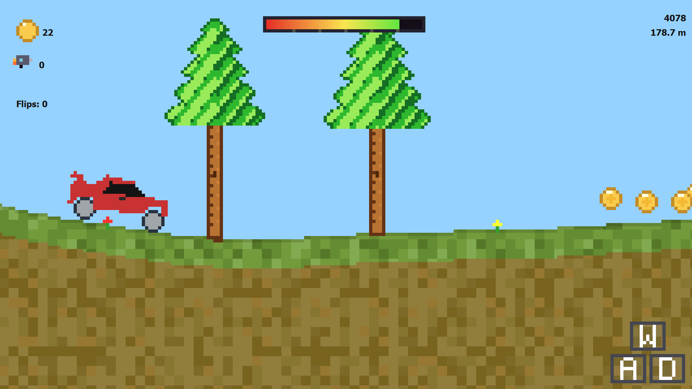
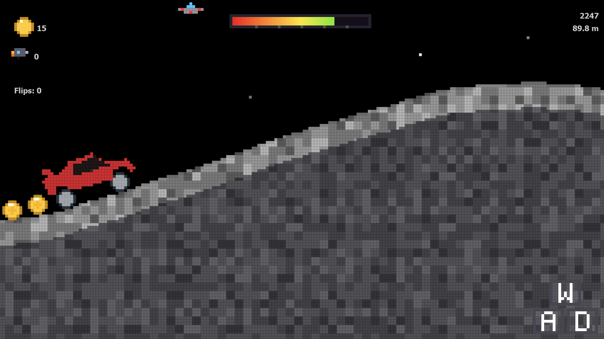
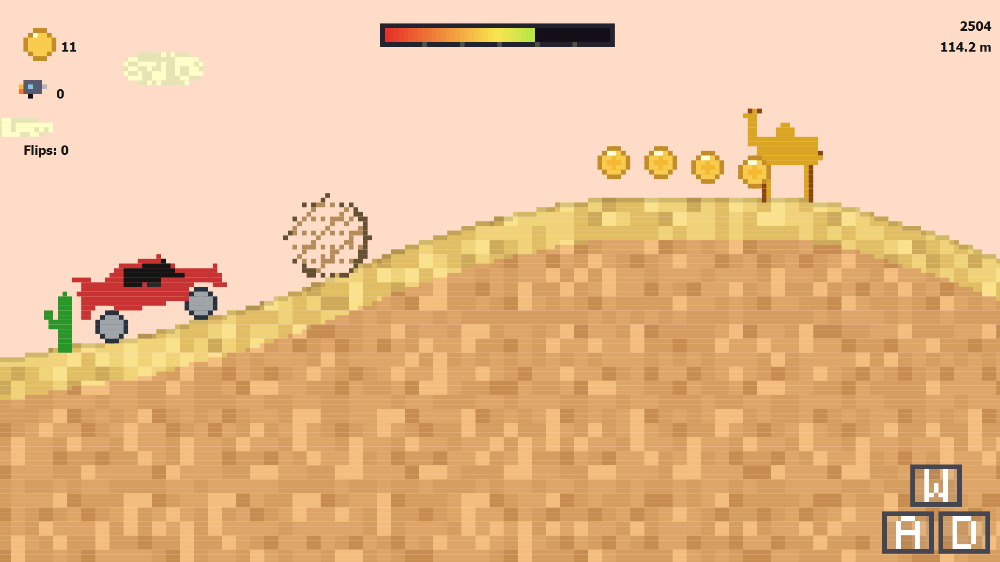
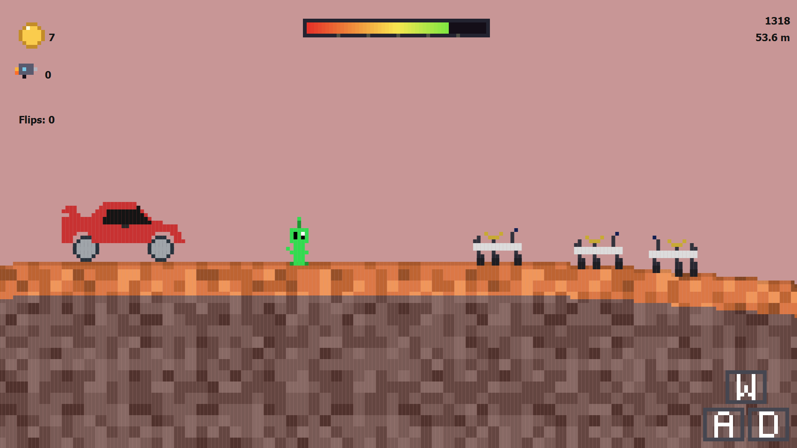
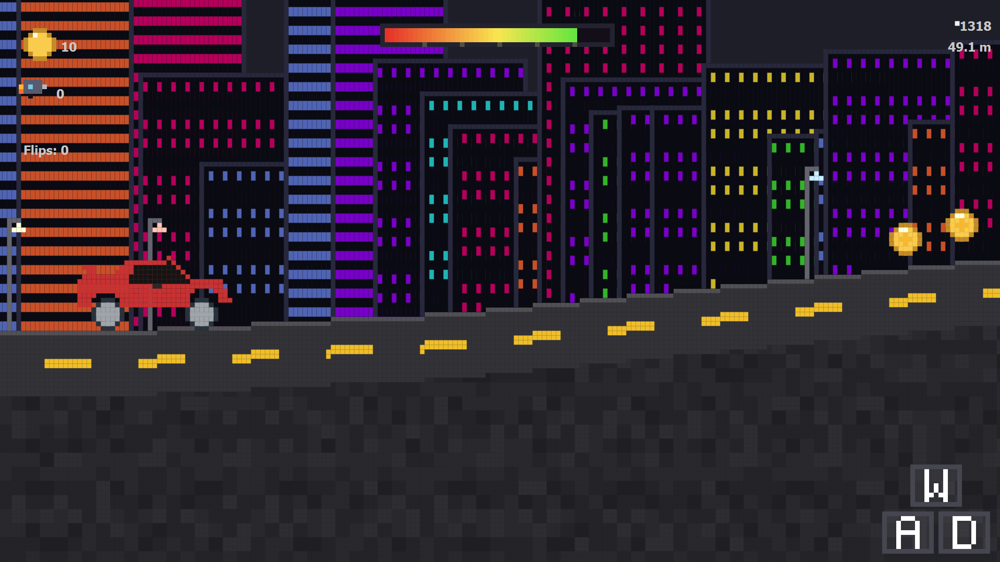

# 🧪 BRAKING BAD: The Physics-Based Hill Climber 🚗

<div align="center">


**An infinite procedural driving game built from scratch using C++ and Qt.**
*Features soft-body physics, dynamic terrain, 6 unique biomes, and a reactive audio system.*


</div>

---

## 🎮 About The Game

**Braking Bad** is a high-octane, 2D physics-based driving game inspired by *Hill Climb Racing*. Built entirely within the **Qt Framework** without external game engines, it demonstrates advanced graphical programming, custom physics integration, and procedural content generation.

Navigate treacherous terrains, manage your fuel, perform aerial stunts for bonus coins, and upgrade your vehicle to conquer the leaderboard!

---

## ✨ Key Features

### 🏎️ Physics & Mechanics
* **Soft-Body Suspension:** Custom implementation of damped spring-mass systems for realistic car handling and wheel suspension.
* **Camera Stabilization:** Second-order damped lag system that smoothly tracks the vehicle, filtering out high-frequency jitter.
* **Nitro Boost:** A thrust at the back wheel that boosts the car and can make it fly.

### 🌍 Procedural Generation
* **Infinite Terrain:** Perlin-noise/Random-walk based terrain generation that increases in difficulty (slope/irregularity) as you drive.
* **6 Distinct Biomes:**
    * 🌿 **Meadow:** Grassy slopes and trees.
    * 🌵 **Desert:** Sand dunes, camels, and tumbleweeds.
    * ❄️ **Tundra:** Ice spikes, slippery friction, and igloos.
    * 🌑 **Lunar:** Low gravity, craters, and UFOs.
    * 🔴 **Martian:** Red dust, rovers, and aliens.
    * 🌃 **Nightlife:** Neon-lit procedural skyscrapers with scrolling window logic.

---

## 📸 Gallery

### 🌎 Diverse Biomes
| Earth-Based | Exotic & Urban |
|:---:|:---:|
| <br>_Meadow_ | <br>_Lunar_ |
| <br>_Desert_ | <br>_Martian_ |
| <br>_Tundra_ | <br>_Nightlife_ |


## ⌨️ Controls

| Key | Action | Description |
| :---: | :--- | :--- |
| **W / Up** | **Nitro** | Boost. Uses more Fuel. |
| **D / Right** | **Accelerate / Pitch Up** | Moves car forward and rotates counter-clockwise in air. |
| **A / Left** | **Decelerate / Pitch Down** | Moves car backward and rotates clockwise in air. |
| **P** | **Pause** | Freezes game state. |
| **S** | **Scoreboard** | View local high scores. |
| **ESC** | **Exit** | Close the game. |

---

## 🛠️ Installation & Build

### Prerequisites
* **C++ Compiler:** GCC/Clang/MSVC supporting C++17.
* **Qt Framework:** Qt 6.x (Core, Gui, Widgets, Multimedia).
* **Build System:** qmake or CMake.

### Steps

1.  **Clone the repo**
    ```sh
    git clone [https://github.com/yourusername/braking-bad.git](https://github.com/yourusername/braking-bad.git)
    cd braking-bad
    ```

2.  **Build using qmake**
    ```sh
    mkdir build && cd build
    qmake ..
    make -j4
    ```

3.  **Run**
    ```sh
    ./BrakingBad
    ```

---

## 👨‍💻 Author

**[Shinjan Roy](https://github.com/Lactose-Tolerance)**
**[Souradeep De](https://github.com/souradeepde05)**
**[Arko Dasgupta](https://github.com/arkodasgupta0412)**
**[Arjeesh Palai](https://github.com/shadowbeast0)**
* Computer Science & Engineering, Jadavpur University (2027)

---

<div align="center">
  <sub>Built with sleepless nights and C++</sub>
</div>
